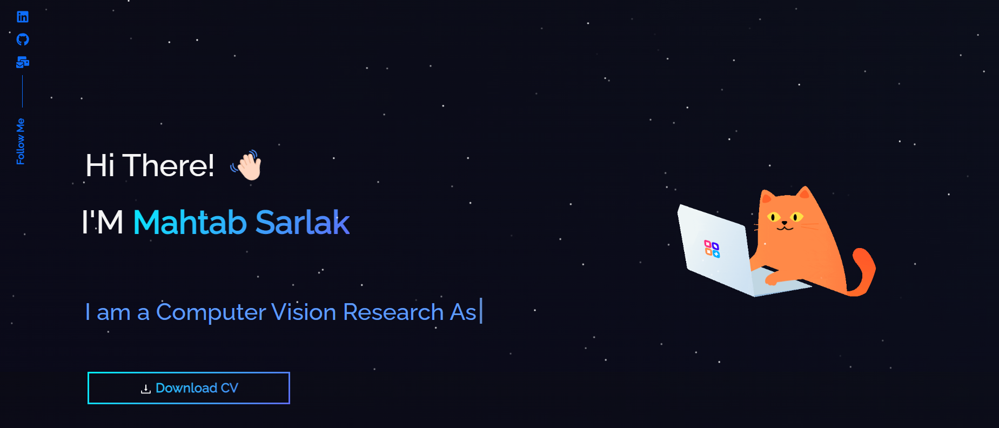

<h2 align="center">
  Portfolio Website 
  <a href="" target="_blank">link</a>
</h2>

  

 

## Built With

My personal portfolio <a href="" target="_blank">link</a> which features some of my github projects as well as my resume and technical skills. 

This project was built using these technologies.

- React.js
- Bootstrap
- CSS
- tsParticles

## 🛠 Setup Instructions

1. Installation: `npm install`

2. In the project directory, you can run: `npm start`

Runs the app in the development mode.\
Open [http://localhost:3000](http://localhost:3000) to view it in the browser.

